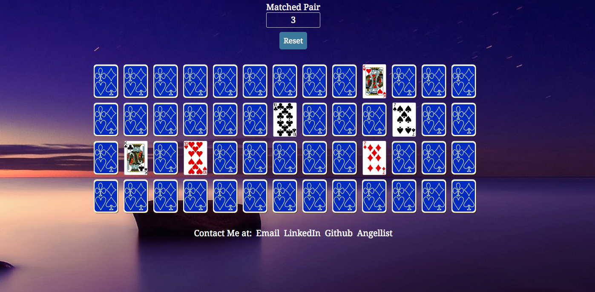

# Memory

Simple and fun card game to test your memory and concentration built with JavaScript and React.js.     

[Play now](http://tsi.life/Memory/)

### Features/Functionality

- [ ] Game mode: Easy(8 cards) and Normal(52 cards)
- [ ] Animation to simulate a card flipping when clicked on
- [ ] Cards will be flipped back to face down if the two cards the player chose does not match
- [ ] Player is not allowed to flip more than two cards each turn
- [ ] Matched cards will stay open through out the game
- [ ] Score count to show how pairs the user has matched
- [ ] Game will end when the user exposes all the matched pairs or restart the game

### Detail

* Created a card, board and game class to handle each object's component
* Implemented redux containers to fetch AJAX request for celebratory animation when the game is completed
* Renders each card component with specific card animation to enhance player's experience
* Optimized random card placement with card shuffling logic
* Leveraged classes in CSS styling to render different card layout dependent on game mode
* Used React Modal to trigger user input and transition from game play to game completion
